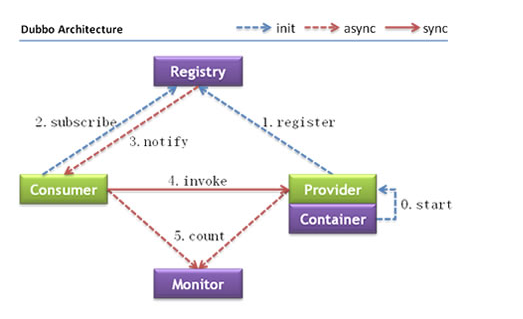
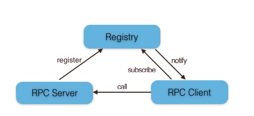

## RPC概述
RPC（Remote Procedure Call ）——远程过程调用，它是一种通过网络从远程计算机程序上请求服务，而不需要了解底层网络技术的协议。

通俗一点说就是：调用远程计算机上的服务，就像调用本地服务一样，让调用者对网络通信这些细节透明。

## 开源的优秀RPC框架
* [阿里巴巴 Dubbo](https://github.com/alibaba/dubbo)：[https://github.com/alibaba/dubbo](https://github.com/alibaba/dubbo)
* [新浪微博 Motan](https://github.com/weibocom/motan)：[https://github.com/weibocom/motan](https://github.com/weibocom/motan)
* [gRPC](https://github.com/grpc/grpc)：[https://github.com/grpc/grpc](https://github.com/grpc/grpc) 
* [rpcx ](https://github.com/smallnest/rpcx)：[https://github.com/smallnest/rpcx](https://github.com/smallnest/rpcx) 
* [Apache Thrift ](https://thrift.apache.org/)：[https://thrift.apache.org/](https://thrift.apache.org/)

### 一次RPC调用的流程
如下图所示: 
 

过程描述如下：
1. 服务消费方（client）调用以本地调用方式调用服务；
2. client stub接收到调用后负责将方法、参数等组装成能够进行网络传输的消息体；
3. client stub找到服务地址，并将消息发送到服务端；
4. server stub收到消息后进行解码；
5. server stub根据解码结果调用本地的服务；
6. 本地服务执行并将结果返回给server stub；
7. server stub将返回结果打包成消息并发送至消费方；
8. client stub接收到消息，并进行解码；
9. 服务消费方得到最终结果。

RPC的目标就是要2~8这些步骤都封装起来，让用户对这些细节透明。

## RPC框架架构
在RPC框架中主要有三个角色：Provider、Consumer和Registry。如下图所示：

### 节点角色说明：
* Provider: 暴露服务的服务提供方。
* Consumer: 调用远程服务的服务消费方。
* Registry: 服务注册与发现的注册中心。

### 调用关系说明：
0. 服务容器负责启动，加载，运行服务提供者。
1. 服务提供者在启动时，向注册中心注册自己提供的服务。
2. 服务消费者在启动时，向注册中心订阅自己所需的服务。
3. 注册中心返回服务提供者地址列表给消费者，如果有变更，注册中心将基于长连接推送变更数据给消费者。
4. 服务消费者，从提供者地址列表中，基于软负载均衡算法，选一台提供者进行调用，如果调用失败，再选另一台调用。
5. 服务消费者和提供者，在内存中累计调用次数和调用时间，定时每分钟发送一次统计数据到监控中心。

## 技术要点
一个简单的RPC框架架构如下：
 

主要技术要点如下：
* 透明化调用
* 消息的编码和解码
* 通信框架
* 注册中心

### 1. 透明化调用
RPC框架需要封装通信细节让用户像以本地调用方式调用远程服务，如何才能做到透明化调用呢？对Java来说就是使用动态代理技术。
Java动态代理实现有两种实现方式：
* Jdk动态代理；
* 字节码生成工具(Cglib, Javassist )。

许多优秀的Java框架都使用了动态代理技术，例如Spring AOP、MyBatis、众多RPC框架等。

### 2. 消息编码和解码
#### 2.1 消息数据结构
客户端代理里需要封装通信细节，客户端和服务端进行通信的第一步就是要确定客户端和服务端相互通信的消息结构。包含客户端请求消息和服务端响应消息。

客户端的请求消息（Request）结构一般需要包括以下内容：
* 接口名称
完全类名，例如 “mango.demo.service.DemoService”；
* 方法名
* 参数类型&参数值
* 超时时间
* requestId，标识唯一请求id。

服务端返回的消息结构一般包括以下内容：
* 执行结果（返回值or异常）
* requestId

### 2.2 序列化
#### 什么是序列化？
   序列化就是将数据结构或对象转换成二进制流的过程，也就是编码的过程。
#### 什么是反序列化？
   将在序列化过程中所生成的二进制流转换成数据结构或者对象的过程。
#### 选型：从RPC角度上看，主要考虑3点：
* 通用性，比如是否能支持Map等复杂的数据结构；
* 性能，包括时间复杂度和空间复杂度，由于RPC框架将会被公司几乎所有服务使用，如果序列化上能节约一点时间，对整个公司的收益都将非常可观，同理如果序列化上能节约一点内存，网络带宽也能省下不少；
* 扩展性，支持自动增加新的业务字段，删除老的字段，而不影响老的服务；

目前国内各大互联网公司广泛使用hessian、protobuf、thrift、avro等成熟的序列化解决方案来搭建RPC框架。（性能测试参见：[jvm-serializers benchmark](https://github.com/eishay/jvm-serializers/wiki)）

### 3. 通信框架
目前有两种IO通信模型：
* BIO：同步阻塞式IO，简单理解：一个连接一个线程
* NIO：非阻塞I/O.

如何实现RPC的IO通信框架?
* 使用java nio方式自研，这种方式较为复杂，而且很有可能出现隐藏bug；
* 基于mina，mina在早些年比较火热，近些年版本更新缓慢；
* 基于netty，现在很多RPC框架都直接基于netty，比如阿里巴巴的HSF、dubbo，新浪微博的motan，Google的gRPC，Twitter的finagle等。

### 4. 注册中心
服务注册中心功能包括注册服务、订阅服务、服务变更通知等功能；
Server端会在系统初始化时通过registry模块注册服务；
Client端在系统初始化时会通过registry模块订阅到具体提供服务的Server列表，当Server列表发生变更时也由registry模块通知Client。

注册中心选型：
* ZooKeeper
* Eureka
* Etcd
* Consul

通常情况下我们选用Zookeeper作为注册中心。

## 参考资料
[你应该知道的 RPC 原理](http://blog.jobbole.com/92290/)

--------END-------
